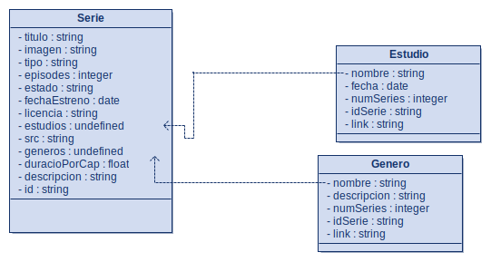

# WebScrapping
Antes de ejecutar el código es necesario especificar la ubicación de Firefox

## Explicación del programa
El programa está preparado para poder guardar todas las series de un género específico con todos sus estudios y géneros.
El único problema es que puede tardar mucho en guardar, ya que si no la página detecta que es un robot. Por ello para ahorrar tiempo hago que cuando encuentre un género o estudio repetido hago que reutilice datos para evitar entrar de nuevo a la página del mismo y por ello cuanto más guarda más rápido va.

# Diagrama de clases

